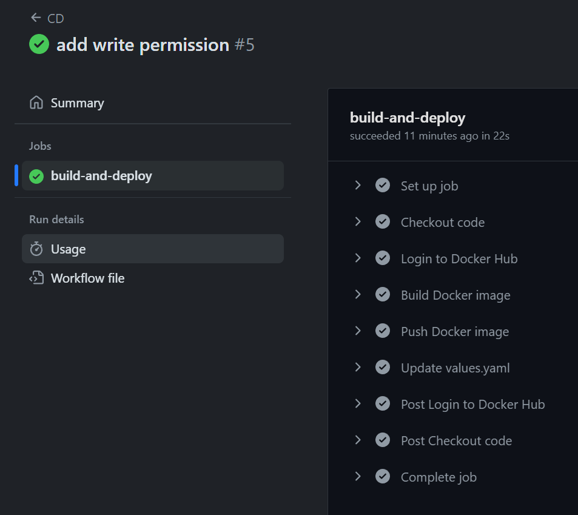
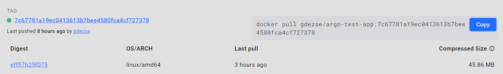
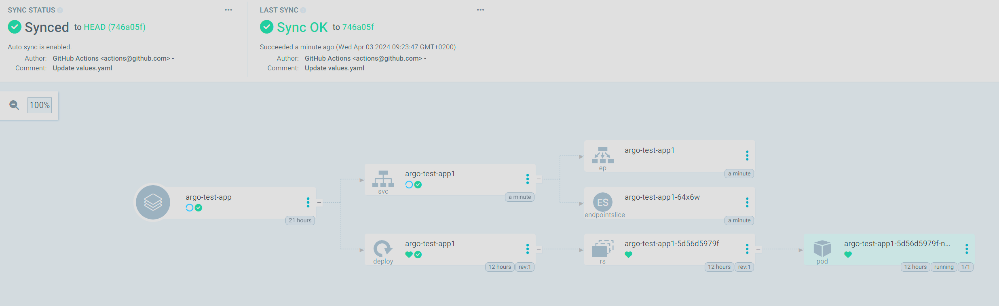
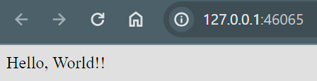
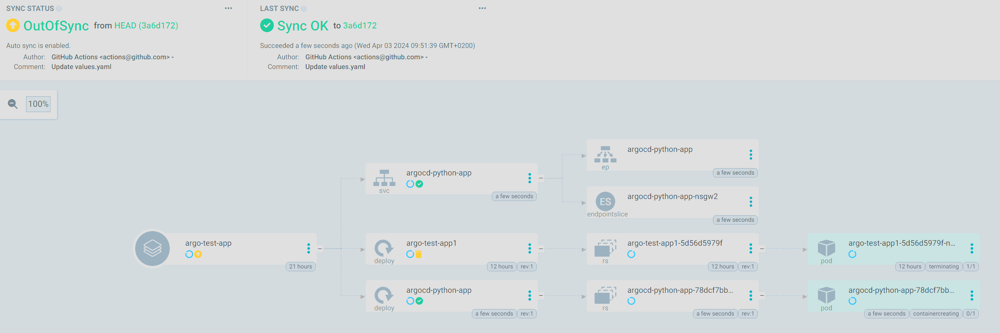
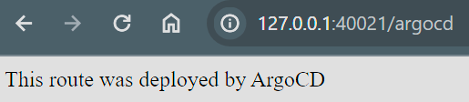

# cd

## Előkészületek

A `DOCKERHUB_USERNAME` változót secret helyett variable-ként mentettem el. Ehhez a változót a `secrets` helyett a `vars` kontextusból kell hivatkozni: `DOCKERHUB_USERNAME: ${{ vars.DOCKER_USERNAME }}`.

(Kezdetben nem találta a változókat, ennek oka az volt, hogy a leírásban DOCKERHUb prefix volt a beállításnál megadva, de, ahogy a workglow yaml-ből is látszik, DOCKER előtaggal kereste)

## GitHub action

A values.yaml módosításához szükséges repo push jog nem volt megadva, ehhez a
```yaml
permissions:
  contents: write
```
módosítást kellett a job-on beállítani.

Ezt követően már sikeresen lefutott a workflow



## Docker Hub

A workflow sikeresen feltöltötte az új container image-et Docker Hubra



## ArgoCD

Sikeresen létrejött a kezdeti állapot



## Szerver

A szerver is megfelelően működött



## Módosítások

Felvettem egy új végpontot, ami kiírja, hogy ezt az ArgoCD deploy-olta.

```python
@app.route("/argocd")
def argocd():
    return "This route was deployed by ArgoCD"
```

Template változóba raktam az alkalmazás nevét, ezt minden helyen kicseréltem a manifestekben. Értékét a `values.yaml` fájlban, az image taghez hasonlóan cserélem.

A névcsere után láthatóan automatikusan frissült a cluster állapota



És megjelent az új végpont is

